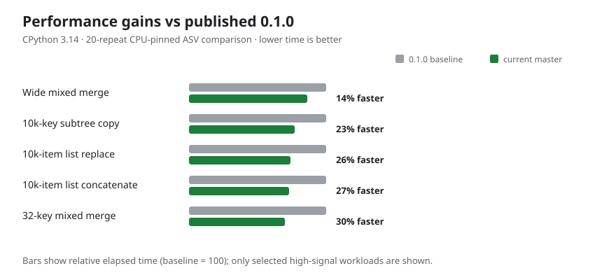

# Local benchmark results

Measured on 2026-10-02 with CPython 3.14.0, Rust 1.98.1, Linux x86-64,
and an AMD Ryzen 7 9800X3D. Weave was compiled in release mode. Both
implementations return independent dictionary/list containers and share opaque
leaves; each case checks equivalent results before timing.

| Workload | Weave | Python reference | Speedup |
| --- | ---: | ---: | ---: |
| Tiny dictionaries | 148 ns | 704 ns | 4.8× |
| Flat dictionaries, 10,000 keys each | 329 µs | 2,050 µs | 6.2× |
| Nested configuration, 100 services | 21.4 µs | 126 µs | 5.9× |
| Nested configuration with list concatenation | 22.8 µs | 152 µs | 6.7× |
| Deep dictionaries, 100 levels | 7.70 µs | 30.9 µs | 4.0× |
| Replace a list of 10,000 scalars | 14.7 µs | 574 µs | 39.1× |
| Concatenate lists of 10,000 scalars each | 30.6 µs | 1,170 µs | 38.1× |
| Concatenate lists of nested containers | 96.3 µs | 431 µs | 4.5× |
| Overwrite a nested subtree with `None` | 148 ns | 515 ns | 3.5× |

These are historical short local measurements from the original pyperf harness,
not performance guarantees or comparisons against other libraries. Pyperf
reported insufficient samples to establish variation below 1%. The Python
reference recursively visits scalar list elements; Weave uses native copies and
only recurses into containers, which accounts for the larger improvement on
scalar lists.

## ASV comparison with 0.1.0



The [interactive report](performance.html) is a single self-contained HTML file.
On each push to `master`, GitHub Actions measures Weaved and the Python reference
in the same ASV run, appends their speedup ratios to `performance-data.json`, and
regenerates the report. The ratios reduce variation between hosted runner
instances. Download the HTML and open it in a browser; no hosted Pages site is
needed.

On the same machine, a 20-repeat CPU-pinned CPython 3.14 ASV comparison on
2026-10-03 measured the 10,000-key flat merge at 342 ± 4 µs on the published
0.1.0 source and 302 ± 5 µs on current `master` (about 12% faster, below ASV's
1.15 threshold). A wide mixed case with one nested value at the end improved
from 285 ± 3 µs to 244 ± 4 µs (about 14%). Replacing a 10,000-item scalar list
improved from 20.4 ± 0.6 µs to 15.1 ± 0.9 µs (about 26%); concatenating two
such lists improved from 39.0 ± 0.8 µs to 28.3 ± 1 µs (about 27%). The
32-key mixed case with a nested value last improved from 3.00 ± 0.4 µs to
2.11 ± 0.3 µs (about 30%).

The maintained Airspeed Velocity suite runs each implementation on the same
workloads and compares revisions statistically. Run it from the project root:

```sh
uv run asv continuous --factor 1.15 --interleave-rounds --split HEAD^ HEAD
```

ASV stores benchmark records in `.asv/results`. After editing Rust, ASV builds
the selected revision in release mode before measuring it.

The scalar subtree copy path was then changed to scan dictionary entries
without creating Python wrappers for scalar values. Twenty-repeat CPU-pinned
CPython 3.14 ASV measurements put this 10,000-key copy at 50.1 ± 0.5 µs before
and 38.7 ± 0.8 µs after (about 23% faster). With a nested value at the end, it
improved from 50.4 ± 0.5 µs to 38.7 ± 0.9 µs (about 23%). A 20-repeat
CPU-pinned CPython 3.11 comparison measured 48.4 ± 0.7 µs and 44.0 ± 1 µs
(about 9% faster, below ASV's 1.15 change threshold). With a nested value at
the end, it improved from 50.3 ± 1 µs to 44.9 ± 1 µs (about 11%). On CPython
3.11, list replacement improved from 14.7 ± 0.3 µs to 11.2 ± 0.2 µs (about
24%) and concatenation from 28.3 ± 0.4 µs to 21.9 ± 0.3 µs (about 23%). The
flat merge improved from 358 ± 4 µs to 340 ± 3 µs and the wide mixed merge
from 293 ± 5 µs to 276 ± 5 µs on CPython 3.11; both stayed below the 1.15
threshold. Large integer-key maps also showed no significant change. A string
map with one integer key at the end measured
279 ± 3 µs on the published source and 307 ± 3 µs on current `master` (about
10% slower, below the 1.15 threshold); the optimized path must scan keys to
prove it can safely bulk-update them. A 32-key map with one integer key at the
end measured 2.14 ± 0.08 µs and 2.40 ± 0.08 µs respectively (about 12% slower,
below the threshold). Copies of scalar-only dictionaries from
1 to 256 entries showed no significant change, so the direct scan remains
unconditional in the subtree-copy path.
For a 32-key map with a nested value last, a 20-repeat CPU-pinned comparison
improved from 3.00 ± 0.4 µs on the published source to 2.11 ± 0.3 µs on current
`master` (about 30% faster) on CPython 3.14. CPython 3.11 improved from 2.18 ±
0.2 µs to 1.42 ± 0.1 µs (about 35%). The raw-scan path now starts at 8
entries and only bulk-updates after the first 2 entries contain no nested
containers. Moving the cutoff from 16 to
8 improved the 8-entry late-nested case from 1.73 ± 0.2 µs to 1.28 ± 0.2 µs
(about 26%) in a 20-repeat CPU-pinned CPython 3.14 comparison. The matching
CPython 3.11 run showed no significant change. Four-entry mixed maps and
8-entry scalar-only, early-nested, prefix-boundary, and late-integer cases
showed no significant change when lowering the cutoff.
Lowering the prefix from 4 entries to 2 improved an 8-entry map with its
nested value at position 2 by about 20% on CPython 3.14 and 14% on CPython 3.11;
the early, boundary, nested, and wide cases showed no significant change.
